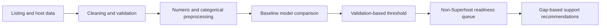

# Airbnb Superhost Readiness Engine

A machine-learning decision-support project that identifies non-Superhost listings whose operating characteristics resemble those of current Superhosts, then turns measurable gaps into suggested host-support actions.

> [!IMPORTANT]
> This is a point-in-time **readiness classifier**, not a validated forecast of which hosts will become Superhosts. A true conversion model would require dated, longitudinal snapshots in which features precede the future outcome.

## Project overview

Superhost status is associated with signals such as guest ratings, review history, responsiveness, listing availability, and operating consistency. This project combines those signals into:

1. a probability score for current Superhost status;
2. a ranked queue of non-Superhost listings with Superhost-like characteristics; and
3. rule-based recommendations tied to observable performance gaps.

I originally built this project during my master's program. I revisited it to tighten the evaluation, document the limitations, and make the results easier to reproduce.

## Results

The refreshed benchmark uses a New York City snapshot with 35,917 labeled listings and 21,342 hosts. Every listing from a host is assigned to exactly one split, preventing the entity leakage found in the historical notebook.

| Unseen-host test metric | Histogram gradient boosting |
|---|---:|
| ROC-AUC | **0.907** |
| PR-AUC | **0.684** |
| Recall | **0.735** |
| Precision | **0.625** |
| F1 score | **0.676** |
| Balanced accuracy | **0.811** |
| Brier score | **0.098** |
| Selected threshold | **0.35** |

### Baseline comparison

| Model | ROC-AUC | PR-AUC | Precision | Recall | F1 |
|---|---:|---:|---:|---:|---:|
| Dummy prior | 0.500 | 0.206 | 0.206 | 1.000 | 0.341 |
| Logistic regression | 0.781 | 0.490 | 0.556 | 0.377 | 0.449 |
| Histogram gradient boosting | **0.907** | **0.684** | **0.625** | **0.735** | **0.676** |

Gradient boosting performed best in this comparison. It exceeds the historical ANN's 0.896 ROC-AUC despite the stricter unseen-host evaluation. See the full [`benchmark report`](reports/benchmark.md).

The operating threshold is selected on validation data by maximizing recall subject to precision of at least 0.50. In a real deployment, it should instead be chosen from outreach capacity and the relative costs of false positives and false negatives.

### Historical ANN result

The committed notebook records the master's-project ANN run: 0.896 ROC-AUC, 0.759 PR-AUC, 0.823 recall, and 0.528 precision. Those values used listing-level splits in which 1,175 hosts appeared in both train and test data. They are retained for transparency, but they are no longer the project's headline benchmark.

## How it works



The notebook:

- cleans percentage, currency, boolean, numeric, and categorical fields;
- imputes missing values, standardizes numeric features, and one-hot encodes categories;
- compares dummy, logistic-regression, gradient-boosting, and historical ANN results;
- tunes an operating threshold on validation data;
- reports discrimination and classification metrics on an untouched test set; and
- ranks non-Superhost rows and attaches interpretable, rule-based recommendations.

## Repository structure

```text
.
├── README.md
├── airbnb_superhost_acceleration_engine_code.ipynb
├── data/
│   └── README.md
├── docs/
│   └── model-card.md
├── reports/
│   ├── benchmark.md
│   └── baseline-results.json
├── src/
│   └── train_baselines.py
├── tests/
│   └── test_train_baselines.py
├── .gitignore
└── requirements.txt
```

The historical notebook filename is retained so existing links continue to work.

## Reproduce the notebook

The source dataset is not committed to this repository. See [`data/README.md`](data/README.md) for the expected files, schema, and known provenance gap.

```bash
git clone https://github.com/mandelaokeke/superhost-prediction.git
cd superhost-prediction

python -m venv .venv
source .venv/bin/activate
python -m pip install --upgrade pip
python -m pip install -r requirements.txt

jupyter lab airbnb_superhost_acceleration_engine_code.ipynb
```

Place the three prepared CSV files under `data/Data/` before running all cells:

```text
data/Data/airbnb_train.csv
data/Data/airbnb_validation.csv
data/Data/airbnb_test.csv
```

Run the leakage-resistant baselines:

```bash
python src/train_baselines.py
```

Run the baseline unit tests:

```bash
python -m unittest discover -s tests
```

## What the model can and cannot say

The model estimates how closely a row resembles the **current** Superhost class in the historical dataset. It can support exploratory segmentation and help demonstrate an end-to-end ML workflow.

It cannot establish:

- that a host will become a Superhost in the future;
- that changing a recommended feature will cause status to change;
- that the reported metrics will transfer to another city or time period; or
- that the scores are suitable for consequential, automated decisions.

See the [`model card`](docs/model-card.md) for evaluation details, risks, and intended use.

## Known limitations

- **Point-in-time target:** features and target come from the same observation period.
- **Historical host leakage:** 1,175 hosts crossed the original train/test boundary. The refreshed benchmark eliminates this overlap.
- **Incomplete provenance:** the data is a New York City snapshot scraped February 13–14, 2026, but its exact download URL and license record remain unconfirmed.
- **Overfitting:** validation AUC peaked earlier in training and declined by the final epoch. The refreshed notebook adds early stopping for future runs, but the historical metrics above come from the saved 40-epoch run.
- **Missing inputs:** several nominally selected fields were entirely missing in the saved run and were skipped by the imputer.
- **Uncalibrated scores:** ranking performance was measured, but probability calibration was not.
- **Rule-based actions:** recommendation thresholds are illustrative and require domain validation.

## Next steps

- [x] Correct the forecasting claim and document intended use.
- [x] Add reproducible setup, data contract, model card, and repository hygiene.
- [x] Add early stopping and input-quality checks to the notebook.
- [ ] Recover the exact source URL and license record.
- [x] Re-split by `host_id`.
- [x] Compare dummy, logistic-regression, and gradient-boosted tree baselines.
- [x] Add Brier-score and initial subgroup diagnostics.
- [ ] Add probability calibration and robust feature attribution.
- [ ] Build a true future-conversion target from longitudinal snapshots.
- [ ] Add a small, privacy-conscious interactive demonstration.

## Responsible use

This project is educational. Host and listing identifiers should not be published in exported predictions or screenshots. Any real operational use would require current policy review, data-governance approval, subgroup performance checks, human review, and ongoing monitoring.
